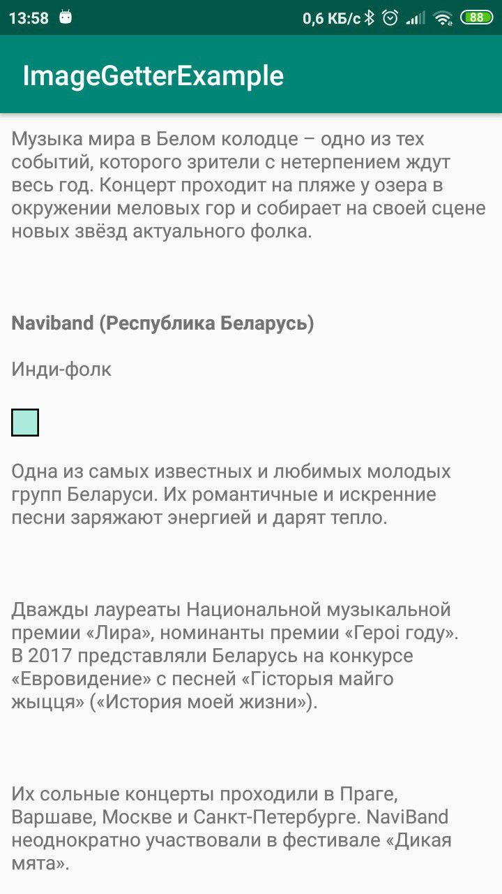

[](https://jitpack.io/#ruslansharipov/imagegetter)

# ImageGetter
Small simple library for downloading images in textView when applying text from html.
Uses Picasso as dependency.

|Turns this|Into this|
|:-:|:-:|
|||

To use in simple case of loading images into textView you can use two arguments constructor in which you pass your instance of Picasso and TextView into which pictures should be loaded.

```kotlin
val imageGetter = PicassoImageGetter(Picasso.get(), textView)
textView.text = HtmlCompat.fromHtml(simpleExampleText, HtmlCompat.FROM_HTML_MODE_LEGACY, imageGetter, null)
```

If needed you can specify UrlEditor if urls you get from html are not full, or need to be modified.
Also you can specify placeholder resources for loading and error.

```kotlin
exampleTextView.run {
            val exampleGetter = PicassoImageGetter().apply {
                picasso = Picasso.get()
                textView = this@run
                placeHolderRes = R.drawable.ic_image_black
                errorDrawableRes = R.drawable.ic_error_black
                urlEditor = { source: String ->
                    when {
                        source.startsWith(":") -> "http$source"
                        source.startsWith("/") -> "http:$source"
                        else -> source
                    }
                }
            }
            text = HtmlCompat.fromHtml(exampleText, HtmlCompat.FROM_HTML_MODE_LEGACY, exampleGetter, null)
        }
```

See the example app for more detailes.

To use this library:

Step 1. Add it in your root build.gradle at the end of repositories:
```groovy
	allprojects {
		repositories {
			...
			maven { url 'https://jitpack.io' }
		}
	}
```
Step 2. Add the dependency
```groovy
	dependencies {
	        implementation 'com.github.ruslansharipov:imagegetter:Tag'
	}
```
Based on this https://stackoverflow.com/a/36251602/10951565
If you don't want to use dependency you can just copy PicassoImageGetter.kt into your project
This library is very welcome for contributions, especially for other popular image loading libraries like Glide and Malevich.
